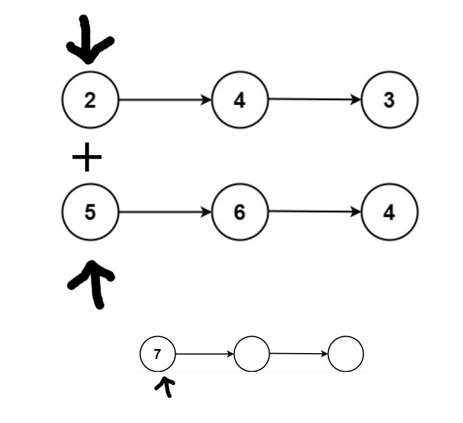

## Problem Statement

The problem statement can be found [here](https://leetcode.com/problems/add-two-numbers/).
To understand the problem it is imperative to understand and properly visualize a singly linked list. We are reqiured to add two non-negative integers with each digit contained in one single node of a given linked list.

## Iterate over the linked lists

**Time**: O(max(l1.size, l2.size)) <br>

The most intuitive solution that came to me was to iterate over both linked lists in the same time and register the sum in another linked list.



```java
/**
 * Definition for singly-linked list.
 * public class ListNode {
 *     int val;
 *     ListNode next;
 *     ListNode() {}
 *     ListNode(int val) { this.val = val; }
 *     ListNode(int val, ListNode next) { this.val = val; this.next = next; }
 * }
 */
class Solution {
    public ListNode addTwoNumbers(ListNode l1, ListNode l2) {
        // Initialize the dummy head with a value of 0
        ListNode initialHead = new ListNode(0);
        // Make our resulting linked list point at its head
        ListNode l3 = initialHead;
        int carry = 0;
        while(l1 != null || l2 != null){
            // Check if each node is not null, if it is replace it with 0 (because we're doing addition)
            int l1Val = (l1 != null) ? l1.val : 0;
            int l2Val = (l2 != null) ? l2.val : 0;

            int currentSum = l1Val + l2Val + carry;
            // Calculate the carry, it'll always be 1 in our case
            carry = currentSum / 10;
            // The remaining digit is found by using modulo 10 (e.g. 12 mod 10 = 2, 10 mod 10 = 0)
            int lastDigit = currentSum % 10;

            ListNode newNode = new ListNode(lastDigit);
            l3.next = newNode;

        // Point l1, l2 and l3 at their next nodes
            if(l1 != null) l1 = l1.next;
            if(l2 != null) l2 = l2.next;
            l3 = l3.next;
        }
        // Make sure our carry isn't lost if we have it at the last elements
        if(carry > 0){
            ListNode newNode = new ListNode(carry);
            l3.next = newNode;
            l3 = l3.next;
        }
        // Return the head's next value since the first one is 0
        return initialHead.next;
    }
}
```

## Ressources that made me understand the problem

I learned that when the problem specifies that you need to return a linked list, it means returning a reference to the head of a node. <br>
[Nick White's video](https://www.youtube.com/watch?v=aM4Iv7eEr2o) was very helpful in properly understanding the solution. <br>
Also [LeetCode's solution](https://leetcode.com/problems/add-two-numbers/solution/) is helpful as well
